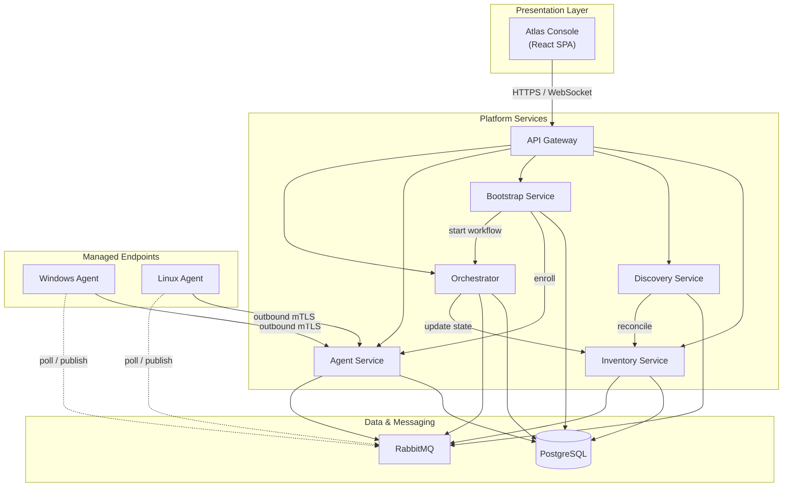

# Atlas Architecture

## Overview

Atlas uses a **modular service architecture**: a web console, five platform services, cross-platform agents, PostgreSQL for durable state, and RabbitMQ for asynchronous events and commands.

- **Synchronous path** — REST over HTTPS for queries and imperative API calls
- **Asynchronous path** — RabbitMQ for discovery events, agent commands, orchestration tasks, and UI notifications

## Architecture Diagram

## Components

| Component | Responsibility | Persistence / Messaging |
|-----------|----------------|-------------------------|
| **Atlas Console** | Dashboards, inventory views, workflow UI, real-time status | Consumes API and WebSocket/SSE events |
| **Inventory Service** | Authoritative registry of hosts, clusters, infobases, relationships, change history | PostgreSQL; publishes `inventory.changes` |
| **Discovery Service** | Scheduled and on-demand detection; deduplication; reconciliation | Publishes `discovery.events` |
| **Bootstrap Service** | Host enrollment tokens, agent packages, prerequisite validation | Triggers Orchestrator; coordinates Agent Service |
| **Agent Service** | Agent registration, heartbeat aggregation, config push, command dispatch | PostgreSQL; `agent.commands` / `agent.results` |
| **Orchestrator** | Multi-step workflows with retry, progress tracking, audit hooks | PostgreSQL; consumes `orchestrator.tasks` |
| **PostgreSQL** | Platform state: inventory, agents, workflows, audit, identity | — |
| **RabbitMQ** | Decoupled event and command transport | — |

### Agents

Agents run on managed hosts (`agent/windows/`, `agent/linux/`). They collect local 1C facts (version, cluster role, processes), report heartbeat, and execute approved commands.

Design constraint: agents initiate **outbound** connections to simplify enterprise firewall rules. Command delivery uses polling or message consumption from RabbitMQ.

## Message Flows

| Queue / Topic | Producer | Consumer | Purpose |
|---------------|----------|----------|---------|
| `discovery.events` | Discovery Service | Inventory Service | New or changed entities |
| `agent.commands` | Agent Service | Agents | Remote execution requests |
| `agent.results` | Agents | Agent Service, Orchestrator | Command outcomes |
| `orchestrator.tasks` | API, Bootstrap Service | Orchestrator | Workflow step dispatch |
| `inventory.changes` | Inventory Service | Console (via gateway) | Live UI updates |

## Technology Stack

Target stack for MVP implementation. Language choices for the Linux agent finalize in Phase 2 (see [Roadmap](../vision/roadmap.md)).

| Layer | Choice | Rationale |
|-------|--------|-----------|
| Backend services | .NET 8 | Strong enterprise adoption; native Windows interoperability for 1C environments |
| Atlas Console | TypeScript, React | Component ecosystem; typed API client generation from OpenAPI |
| Windows agent | .NET 8 (Windows Service) | Shared libraries with backend; first-class Windows integration |
| Linux agent | .NET 8 or Go | Final selection in Phase 2 ADR; Go favored if binary size is critical |
| Database | PostgreSQL 16 | ACID, JSON support, mature HA tooling |
| Message broker | RabbitMQ 3.x | Reliable delivery, routing, operational familiarity |
| API | REST + OpenAPI 3.x | Contract-first; optional gRPC for internal calls later |
| Identity | OpenID Connect | Enterprise SSO integration (Phase 1 stub, Phase 4 full RBAC) |
| Observability | OpenTelemetry | Structured logs, metrics, traces (Phase 4 baseline) |
| Packaging | Docker Compose (dev), containers (prod) | Agents distributed as OS packages (MSI, DEB/RPM) |

## Security Model

| Concern | Approach |
|---------|----------|
| Agent authentication | mTLS or signed enrollment tokens; outbound-only connectivity |
| User authentication | OIDC / SSO |
| Authorization | RBAC: `viewer`, `operator`, `admin` (Phase 4) |
| Audit | Append-only log of inventory mutations and orchestrated actions |
| Secrets | External vault or environment injection; never committed to repository |

## Deployment Topology

**MVP:** single-cluster deployment — all services containerized, co-located PostgreSQL and RabbitMQ (or managed equivalents).

**Production:** stateless services (Discovery, Agent Service, Orchestrator) scale horizontally; PostgreSQL with replication; RabbitMQ clustered. Detailed runbooks added in Phase 4.

## Repository Mapping

| Path | Architectural role |
|------|---------------------|
| `backend/` | Platform services and shared libraries |
| `frontend/` | Atlas Console |
| `agent/windows/`, `agent/linux/` | Endpoint agents |
| `docs/api/` | OpenAPI specifications (Phase 1+) |
| `docs/database/` | Schema documentation and ERDs (Phase 1+) |

Structure decision: [ADR-0001](../adr/ADR-0001-project-structure.md)

## Related Documentation

- [Vision](../vision/vision.md) — goals and non-goals
- [Roadmap](../vision/roadmap.md) — delivery phases
- [Development Workflow](development-workflow.md) — engineering process
